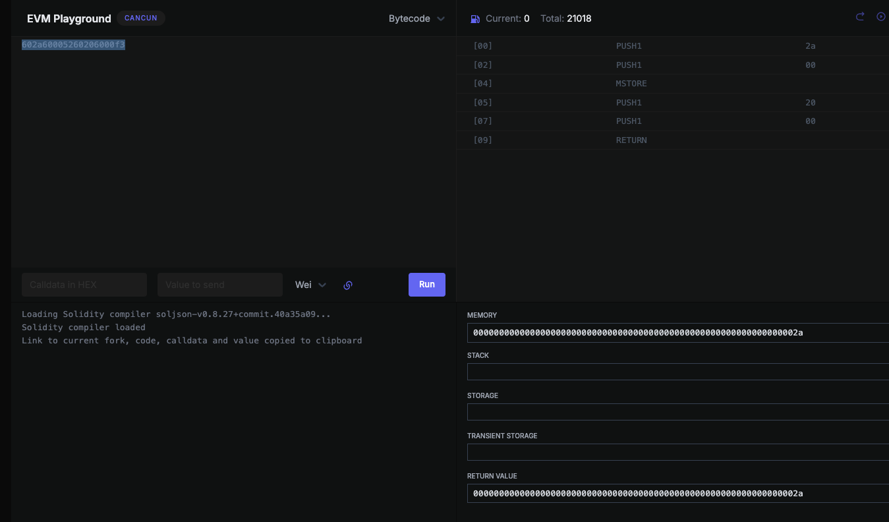

# 지문

이 레벨을 풀기 위해서는 Ethernaut에게 Solver를 제공하면 됩니다. Solver는 whatIsTheMeaningOfLife()에 올바른 32바이트 숫자로 응답하는 컨트랙트예요.

쉽죠? 음… 하지만 함정이 있습니다.

솔버의 코드가 정말 작아야 해요. 진짜, 정말, 엄청나게 작아야 합니다: 최대 10바이트.

힌트: 잠깐 솔리디티 컴파일러의 안락함을 떠나, 이번만큼은 직접 만들어보는 건 어떨까요? 그렇습니다, 생(raw) EVM 바이트코드입니다.

행운을 빕니다!

# 풀이 

여기선 올바른 32바이트 숫자가 뭔지도 답안이 어떻게 처리되어야할지 모름.

일단 여기서 단서를 알아낼 수 있는건 `whatIsTheMeaningOfLife` 함수가 호출된다는것. 그리고 그 함수는 올바른 32바이트 숫자를 뱉어야한다는것.

그리고 Ethernaut에서 `Submit Instance`버튼을 누르면 문제의 답을 검증하는 무언가가 `whatIsTheMeaningOfLife`함수를 호출해서 검증할것임.

지금까지 Ethernaut을 풀어왔을 때 저 버튼을 누르면 metamask가 열리면서 실제 Transaction이 발생하는것을 생각해보면 문제의 답 검증은 onchain에서 하고있음을 유추할 수 있음.

대충 `whatIsTheMeaningOfLife`함수안에 `msg.sender`를 로깅하는 코드를 작성하고 그 주소의 바이트코드를 가져올것임.

revert error message에 `msg.sender`을 기록해보자 

```solidity
// SPDX-License-Identifier: UNLICENSED
pragma solidity ^0.8.13;

import {Script} from "forge-std/Script.sol";
import "forge-std/console.sol";

interface ITarget {
    function setSolver(address _solver) external;
}

contract Recorder {
    address public sender;
    function whatIsTheMeaningOfLife() external returns (bytes32) {
        revert(string(abi.encodePacked("Hiiiii : ", msg.sender)));
        return bytes32(0);
    }
}
contract SolveScript is Script {
    address public target = 0xf3eE3C4Ec25e8414838567818A30C90c7d62f834;

    function setUp() public {}

    // forge script -vvv script/Solve.s.sol --broadcast --tc SolveScript --legacy --private-key 0x5de4111afa1a4b94908f83103eb1f1706367c2e68ca870fc3fb9a804cdab365a --rpc-url http://localhost:8545
    function run() public {
        vm.startBroadcast();
        Recorder helper = new Recorder();
        ITarget(target).setSolver(address(helper));
        vm.stopBroadcast();
    }
}
```

contract 배포 후 답안제출 버튼을 누르면 당연히 revert가 발생할것임.

그리고 cast로 답안제출 transaction을 대상으로 revert error message를 확인해봤음

```shell
hojunghan@hojungui-MacBookPro solve-code % cast rpc --rpc-url http://localhost:8545 debug_traceTransaction 0xe18f952e28497682d5e7b525ea371bfe6b2e7b589fbd36be8f594e87455c068f
Warning: This is a nightly build of Foundry. It is recommended to use the latest stable version. To mute this warning set `FOUNDRY_DISABLE_NIGHTLY_WARNING` in your environment. 

{"failed":true,"gas":38498,"returnValue":"08c379a00000000000000000000000000000000000000000000000000000000000000020000000000000000000000000000000000000000000000000000000000000001d486969696969203a204a679253410272dd5232b3ff7cf5dbb88f295319000000","structLogs":[]}

```

0x4a679253410272dd5232b3ff7cf5dbb88f295319 이 나왔음

```shell
hojunghan@hojungui-MacBookPro solve-code % cast code --rpc-url http://localhost:8545 0x4a679253410272dd5232b3ff7cf5dbb88f295319
Warning: This is a nightly build of Foundry. It is recommended to use the latest stable version. To mute this warning set `FOUNDRY_DISABLE_NIGHTLY_WARNING` in your environment. 

0x608060405260043610610058575f3560e01c80638da5cb5b116100415780638da5cb5b146100a2578063d38def5b146100be578063f2fde38b146100ed575f5ffd5b8063715018a61461005c5780637726f77614610072575b5f5ffd5b348015610067575f5ffd5b5061007061010c565b005b6100856100803660046103c6565b61011f565b6040516001600160a01b0390911681526020015b60405180910390f35b3480156100ad575f5ffd5b505f546001600160a01b0316610085565b3480156100c9575f5ffd5b506100dd6100d83660046103e8565b61014c565b6040519015158152602001610099565b3480156100f8575f5ffd5b506100706101073660046103c6565b610250565b6101146102e5565b61011d5f61033e565b565b5f60405161012c906103a5565b604051809103905ff080158015610145573d5f5f3e3d5ffd5b5092915050565b5f5f8390505f816001600160a01b03166349a7a26d6040518163ffffffff1660e01b8152600401602060405180830381865afa15801561018e573d5f5f3e3d5ffd5b505050506040513d601f19601f820116820180604052508101906101b2919061041f565b90505f816001600160a01b031663650500c16040518163ffffffff1660e01b8152600401602060405180830381865afa1580156101f1573d5f5f3e3d5ffd5b505050506040513d601f19601f82011682018060405250810190610215919061043a565b9050602a811461022a575f935050505061024a565b813b600a811115610241575f94505050505061024a565b60019450505050505b92915050565b6102586102e5565b6001600160a01b0381166102d95760405162461bcd60e51b815260206004820152602660248201527f4f776e61626c653a206e6577206f776e657220697320746865207a65726f206160448201527f646472657373000000000000000000000000000000000000000000000000000060648201526084015b60405180910390fd5b6102e28161033e565b50565b5f546001600160a01b0316331461011d5760405162461bcd60e51b815260206004820181905260248201527f4f776e61626c653a2063616c6c6572206973206e6f7420746865206f776e657260448201526064016102d0565b5f80546001600160a01b038381167fffffffffffffffffffffffff0000000000000000000000000000000000000000831681178455604051919092169283917f8be0079c531659141344cd1fd0a4f28419497f9722a3daafe3b4186f6b6457e09190a35050565b6101628061045283390190565b6001600160a01b03811681146102e2575f5ffd5b5f602082840312156103d6575f5ffd5b81356103e1816103b2565b9392505050565b5f5f604083850312156103f9575f5ffd5b8235610404816103b2565b91506020830135610414816103b2565b809150509250929050565b5f6020828403121561042f575f5ffd5b81516103e1816103b2565b5f6020828403121561044a575f5ffd5b505191905056fe6080604052348015600e575f5ffd5b506101468061001c5f395ff3fe608060405234801561000f575f5ffd5b5060043610610034575f3560e01c80631f8794331461003857806349a7a26d1461008e575b5f5ffd5b61008c6100463660046100d6565b5f80547fffffffffffffffffffffffff00000000000000000000000000000000000000001673ffffffffffffffffffffffffffffffffffffffff92909216919091179055565b005b5f546100ad9073ffffffffffffffffffffffffffffffffffffffff1681565b60405173ffffffffffffffffffffffffffffffffffffffff909116815260200160405180910390f35b5f602082840312156100e6575f5ffd5b813573ffffffffffffffffffffffffffffffffffffffff81168114610109575f5ffd5b939250505056fea26469706673582212205b1e8b5c965a996a400de02a3e689fe0366005323290b1ce9b201ee1d808bf4064736f6c634300081c0033a2646970667358221220fbf1473b05c594f9eaae91375d8d7aeb74f818a62fb02b4a1d0ee9fee69edfc564736f6c634300081c0033
```

그 코드를 기준으로 바이트코드를 가져오고 디컴파일을 시도함. (https://app.dedaub.com/decompile)

기타 잡다한 코드 정리하고 봐야할 것은 아래의 부분임.

```solidity
function 0xd38def5b(address varg0, address varg1) public nonPayable { // 
    require(msg.data.length - 4 >= 64);
    v0, /* address */ v1 = varg0.solver().gas(msg.gas);
    require(bool(v0), 0, RETURNDATASIZE()); // checks call status, propagates error data on error
    require(MEM[64] + RETURNDATASIZE() - MEM[64] >= 32);
    require(v1 == address(v1));
    v2, /* uint256 */ v3 = address(v1).staticcall(uint32(0x650500c1)).gas(msg.gas); // 0x650500c1 == whatIsTheMeaningOfLife()
    require(bool(v2), 0, RETURNDATASIZE()); // checks call status, propagates error data on error
    require(MEM[64] + RETURNDATASIZE() - MEM[64] >= 32);
    if (v3 == 42) { // v3이 return value인데 이게 32바이트이고 42를 출력해야함
        if (v1.code.size <= 10) {
            v4 = v5 = 1;
        } else {
            v4 = v6 = 0;
        }
    } else {
        v4 = v7 = 0;
    }
    return bool(v4);
}
```

정답의 조건을 봤으니 이제 외부 call이 들어오면 그냥 42를 return하는 코드를 작성하고 배포하면됨.

bytecode를 내가 직접 작성해야할 때는 https://www.evm.codes/playground 에서 bytecode 하나하나 수정해가면서 Memory, stack, storage, return value등의 상태를 관찰하면서 작성할 수 있음.

그래서 최종적으로 짠 bytecode는 `602a60005260206000f3`


여기에 배포를 위해서는 앞에 `600a600c600039600a6000f3`을 더하면됨.
이 opcode들의 역할은 다음과 같음.

- `60 0a` 런타임 길이 0x0a(10바이트)

- `60 0c` 런타임 시작 오프셋 0x0c

- `60 00 39` CODECOPY(mem[0], code[0x0c], 0x0a)

- `60 0a 60 00 f3` RETURN(mem[0..10))


cast를 이용해서 배포함 

```shell
hojunghan@hojungui-MacBookPro solve-code % cast send --rpc-url http://localhost:8545 --private-key 0x5de4111afa1a4b94908f83103eb1f1706367c2e68ca870fc3fb9a804cdab365a --create 0x600a600c600039600a6000f3602a60005260206000f3
Warning: This is a nightly build of Foundry. It is recommended to use the latest stable version. To mute this warning set `FOUNDRY_DISABLE_NIGHTLY_WARNING` in your environment. 


blockHash            0x7bd21e2f035a78fc0239c9cdcc3883363fe354043fd987a3633f93d0c8eb8f7c
blockNumber          56427
contractAddress      0x0e724267431C7131B53BE4F6E41310FDFE01c50f
cumulativeGasUsed    55330
effectiveGasPrice    8
from                 0x3C44CdDdB6a900fa2b585dd299e03d12FA4293BC
gasUsed              55330
logs                 []
logsBloom            0x00000000000000000000000000000000000000000000000000000000000000000000000000000000000000000000000000000000000000000000000000000000000000000000000000000000000000000000000000000000000000000000000000000000000000000000000000000000000000000000000000000000000000000000000000000000000000000000000000000000000000000000000000000000000000000000000000000000000000000000000000000000000000000000000000000000000000000000000000000000000000000000000000000000000000000000000000000000000000000000000000000000000000000000000000000000
root                 
status               1 (success)
transactionHash      0xc081396be5f11e9cb218c4db4407e1f15eca4ff4a5c469cea71854b4c2a81f4e
transactionIndex     0
type                 2
blobGasPrice         1
blobGasUsed     
```

그리고 그걸 solver로 세팅하고 답안제출을 하면 문제는 풀림.